<!-- ─────────────────────────  TERMINAL  ───────────────────────── -->

  

<!-- ─────────────────────────  links  ───────────────────────── -->

  
  
  
  

<!-- ─────────────────────────  attached: stats (live from GitHub)  ───────────────────────── -->
<!-- 

  
  

 -->

  

